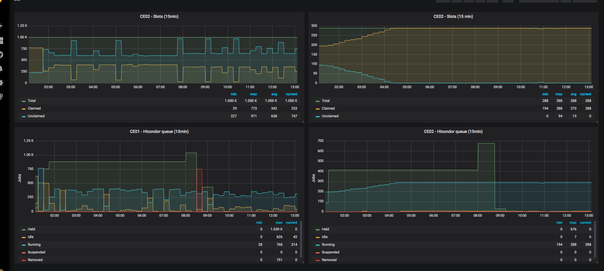

Solution to expose HTCondor metrics through node_exporter

**ATENTION !!!**
In this case specific case, HTCondor-ce runs inside of [HTCondor-CE Container](https://github.com/simple-framework/simple_htcondor_ce).

*If your HTCondor resides on the host machine, you need to modify [condor_textfile_collector.sh](./condor_node_exporter.sh) and remove "docker exec".*

## Installation instructions

*Run installation script*
```
wget -O - https://raw.githubusercontent.com/ejr004/condor_textfile_collector/master/node_exporter_install.sh | bash
```


*Add this line to your crontab*
```
crontab -e

*/5 * * * * /scripts/condor_node_exporter.sh <your-container-ce>
```


*Firewall rules (just in case)*
```
firewall-cmd --zone=public --add-port=9090/tcp --permanent
```
Now you are good to go !

Metrics:
```
# HELP condor_queue_held Metric read from /var/lib/node_exporter/textfile_collector/condor.queue.prom
# TYPE condor_queue_held counter
condor_queue_held{ce="ce01"} 0
# HELP condor_queue_held_alice Metric read from /var/lib/node_exporter/textfile_collector/condor.queue_alice.prom
# TYPE condor_queue_held_alice untyped
condor_queue_held_alice{ce="ce01"} 0
# HELP condor_queue_held_lhcb Metric read from /var/lib/node_exporter/textfile_collector/condor.queue_lhcb.prom
# TYPE condor_queue_held_lhcb untyped
condor_queue_held_lhcb{ce="ce01"} 0
# HELP condor_queue_idle Metric read from /var/lib/node_exporter/textfile_collector/condor.queue.prom
# TYPE condor_queue_idle counter
condor_queue_idle{ce="ce01"} 1
# HELP condor_queue_idle_alice Metric read from /var/lib/node_exporter/textfile_collector/condor.queue_alice.prom
# TYPE condor_queue_idle_alice untyped
condor_queue_idle_alice{ce="ce01"} 0
# HELP condor_queue_idle_lhcb Metric read from /var/lib/node_exporter/textfile_collector/condor.queue_lhcb.prom
# TYPE condor_queue_idle_lhcb untyped
condor_queue_idle_lhcb{ce="ce01"} 1
# HELP condor_queue_removed Metric read from /var/lib/node_exporter/textfile_collector/condor.queue.prom
# TYPE condor_queue_removed counter
condor_queue_removed{ce="ce01"} 0
# HELP condor_queue_removed_alice Metric read from /var/lib/node_exporter/textfile_collector/condor.queue_alice.prom
# TYPE condor_queue_removed_alice untyped
condor_queue_removed_alice{ce="ce01"} 0
# HELP condor_queue_removed_lhcb Metric read from /var/lib/node_exporter/textfile_collector/condor.queue_lhcb.prom
# TYPE condor_queue_removed_lhcb untyped
condor_queue_removed_lhcb{ce="ce01"} 0
# HELP condor_queue_running Metric read from /var/lib/node_exporter/textfile_collector/condor.queue.prom
# TYPE condor_queue_running counter
condor_queue_running{ce="ce01"} 782
# HELP condor_queue_running_alice Metric read from /var/lib/node_exporter/textfile_collector/condor.queue_alice.prom
# TYPE condor_queue_running_alice untyped
condor_queue_running_alice{ce="ce01"} 0
# HELP condor_queue_running_lhcb Metric read from /var/lib/node_exporter/textfile_collector/condor.queue_lhcb.prom
# TYPE condor_queue_running_lhcb untyped
condor_queue_running_lhcb{ce="ce01"} 782
# HELP condor_queue_suspended Metric read from /var/lib/node_exporter/textfile_collector/condor.queue.prom
# TYPE condor_queue_suspended counter
condor_queue_suspended{ce="ce01"} 0
# HELP condor_queue_suspended_alice Metric read from /var/lib/node_exporter/textfile_collector/condor.queue_alice.prom
# TYPE condor_queue_suspended_alice untyped
condor_queue_suspended_alice{ce="ce01"} 0
# HELP condor_queue_suspended_lhcb Metric read from /var/lib/node_exporter/textfile_collector/condor.queue_lhcb.prom
# TYPE condor_queue_suspended_lhcb untyped
condor_queue_suspended_lhcb{ce="ce01"} 0
# HELP condor_status_claimed Metric read from /var/lib/node_exporter/textfile_collector/condor.status.prom
# TYPE condor_status_claimed counter
condor_status_claimed{ce="ce01"} 778
# HELP condor_status_machines Metric read from /var/lib/node_exporter/textfile_collector/condor.status.prom
# TYPE condor_status_machines counter
condor_status_machines{ce="ce01"} 1040
# HELP condor_status_unclaimed Metric read from /var/lib/node_exporter/textfile_collector/condor.status.prom
# TYPE condor_status_unclaimed counter
condor_status_unclaimed{ce="ce01"} 262
# HELP go_gc_duration_seconds A summary of the GC invocation durations.
# TYPE go_gc_duration_seconds summary
```

You can wombo combo with grafana and add [Condor general view Dashboard](./grafana-dashboards/condor_general_view.json) to your grafana dashboard.


*where you are ?*

# Files

### node_exporter_install.sh
Installs node exporter v0.18.1 and setup textfile collector directory on host machine.

### condor_textfile_collector.sh
Generate condor-ce metrics for node exporter file collector

### condor_general_view.json

Condor Grafana Dashboard

# References:
 - https://github.com/simple-framework
 - https://htcondor.readthedocs.io/en/v8_9_3/man-pages/condor_q.html
 - https://htcondor.readthedocs.io/en/v8_9_3/man-pages/condor_status.html
 - https://github.com/prometheus-community/node-exporter-textfile-collector-scripts
 - https://grafana.com/grafana/dashboards